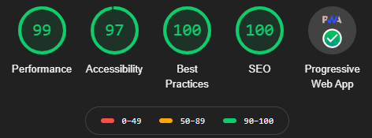
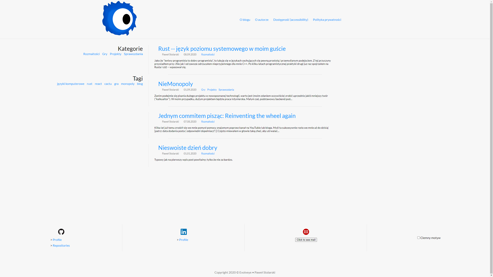
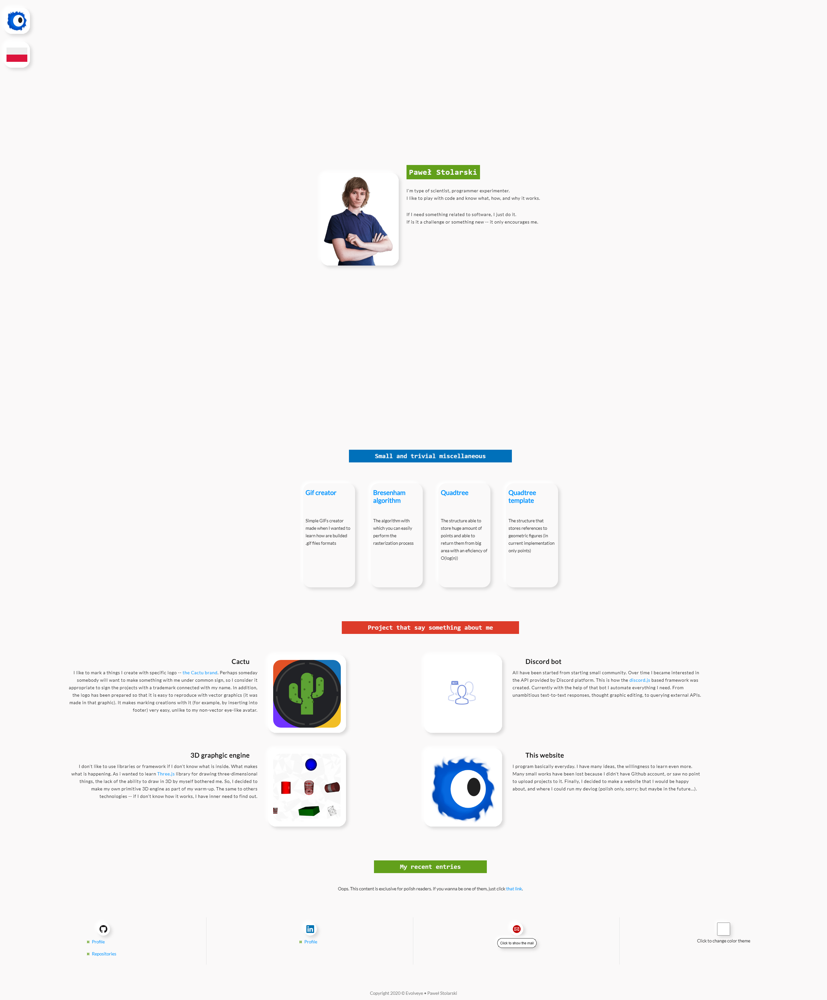

Kilka lat już temu zrodził się we mnie pomysł pomocy znajomym poprzez kanał na YouTubie lub bloga.
Myśl ta sukcesywnie rosła we mnie aż do dzisiaj [patrz: data dodania posta ([odpowiedni dopełniacz?](https://sjp.pwn.pl/poradnia/haslo/post;7717.html))]

Często miewałem w głowie taką chęć, aby utrwalać swoje ~~zawodowe~~ przemyślenia. Być może komuś kiedyś (mi) się one przydadzą.
Jako że niebawem będę rozpoczynać życie zawodowe (tak, nigdy nie pracowałem zarobkowo) to uznałem,
że stworzenie sobie strony internetowej, na której mógłbym zamieszczać proste projekty lub linki do co ciekawszych mych tworów to dobry pomysł.

Miałem już kilka podejść do tworzenia sobie strony i za każdym razem kończyło się to jakąś formą niepowodzenia --
projekt porzucony, wsparcie elementu WebAPI wygasło, za prosta, za brzydka, mało treściwa.
Teraz jednak liczę na to, że dodając od czasu do czasu swoje myśli na stronie, będzie ona atrakcyjniejsza w odbiorze.

Taka personalna strona z blogiem byłaby dla mnie:
 * miejscem moich zawodowych dociekań -- mógłbym chociażby dzielić się wiedzą pozyskaną poprzez pytania do innych
 * miejscem, w które mogę z łatwością odesłać kogoś do napisanego tekstu --
   czy to rozbudowana opinia, która nie nadaje się na czat, czy to opis jakiegoś problemu, *cokolwiek*.
 * publiczną wersją tworzonych sprawozdań (tych wyprodukowanych na ścieżce edukacji lub przez własną chęć opisu *czegoś*)
 * kolejnym punktem rozwoju społeczności (a nawet dwóch)
 * publicznym pokazaniem siebie i swoich kompetencji lub ich braku
 * jedną z form portfolio -- wiele jest takich rzeczy, które nadawałyby się na krótki wpis i mały pokaz
   a ostatecznie po stworzeniu nigdzie nie trafiły (i/więc przepadły)
 * kolejnym oczkiem w głowie, którego mógłbym doglądać i rozwijać

[Kilka](https://sjp.pl/kilka) (lub być może lepiej [parę](https://sjp.pl/kilka)) lat już temu dowiedziałem się o konkursie [Daj się poznać](https://devstyle.pl/daj-sie-poznac/),
lecz moje dowiedzenie się nastąpiło już za późno, aby wystartować. Jestem jednak pewny, że nic by z tego ówcześnie nie wyszło.
Teraz natomiast (w przeciwieństwie do siebie sprzed lat) robię więcej różności, którymi mógłbym się podzielić ze światem,
więc czemu by nie spróbować tego zrobić.
Stworzyłem więc prostą templatkę (mimo poprzednich linków nie określiłbym się jako purysta) w Gatsbym i napisałem ten inicjujący post.

## Kiedy publikacje wpisów

Pozwoliłem sobie zastosować się do popularnej (raczej; na pewno moim zdaniem dobrej)
zasady mówiącej o tym, aby napisać kilka treści przed przystąpieniem do publikowania.
Wyszło to mieszanie. Z jednej strony przygotowałem kilka wpisów, lecz wymagają poprawek.
Cóż, najważniejsze, że blog nie jest stroną główną. W związku z tym spodziewam się około
jednego posta na 2 tygodnie. Czas ten jest na tyle optymalny, że będę w stanie w tym czasie
cokolwiek zrobić i to spisać. Możliwe, że będzie to także zależeć od tego, czy znajdą się czytelnicy.

Jedyne co mi pozostaje na ten moment to napisać: **Witam gorąco; cieszy mnie, że to czytasz**.

## Niedługo o procesie tworzenia strony

Na pierwszy ogień krótko zdecydowałem się opisać to, w jaki sposób powstawała ta strona.
Darowałem sobie opis perypetii i historii więc treść dotyczy jedynie tego,
co widać na dzień publikacji tegoż posta.

Czego by nie mówić, efekt końcowy mnie zadowala.
Setki z dostępności nie zdobyłem umyślnie, kwestia "widzimisię" w kwestii kolorowych nagłówków.
Jedna usterka to ten 1% wydajności.

### Wygląd wstępny, czyli pomyłka

Próbowałem na różne sposoby stworzyć szablon swej strony, lecz wszystkie one cechowały się albo nadmierną ilością miejsca
na dodatkowe elementy (których nie ma) albo wyglądały jak strona organizacji.

Tę stronę początkowo zrobiłem jako odświeżoną wersję [bloga Comandeera](https://blog.comandeer.pl/).
Nie ukrywam, że trochę się nim sugerowałem. Nie jest to jednak jedyna inspiracja --
spoglądałem również na [devstyle.pl](https://devstyle.pl/) oraz na niedawno powstałą [Postać normalną](https://postacnormalna.pl/).

Jednak ten wygląd mi nie odpowiadał. Czułem spory niedosyt.
Co prawda daleko mi do projektanta UI/UX, lecz jeśli chcę określać się jako webmaster
to powinienem umieć zrobić chociażby poprawną lub znośną stronę.
Pokusiłem się więc na odrobinę [neumorfizmu](https://antyweb.pl/nowy-skeumorfizm-i-fluent-design-kontra-plaskie-interfejsy/).

Dodatkowo warto zaznaczyć jedną rzecz -- początkowo uznałem, że [mobile first](https://chcenawczoraj.pl/software/na-czym-polega-mobile-first-w-projektowaniu)
nie jest mi wielce potrzebny w tym przypadku, ponieważ tak prosty projekt jak blog to przecież pojedyncze boxy,
których rozmieszczenie zależy od "flexowego" wyświetlania, lub grida. To był spory błąd myślowy,
ponieważ natrafiłem na problemy związane z pozycjonowaniem relatywnym po przesunięciu elementu.
To tylko jeden z wielu problemów, które mogły się przytrafić. Dodatkowo moje wytłumaczenie było bez sensu,
gdyż obecnie większość stron to pojedyncze okna, które łatwo dopasować do wyglądu mobilnego
(a pewnie jest tak, dlatego że właśnie projektanci stosują się do `mobile first`).

### Podejście drugie -- mniej, lecz więcej

W drugim podejściu zdecydowałem o tym, aby `paddingi` i `marginy` były duże.
Całą stronę podzieliłem na sekcje, jak to się obecnie dość często robi.
Każda sekcja to pojedynczy komponent (strona robiona przy pomocy [gatsbiego](https://www.gatsbyjs.com/)).
Całość wyszła raczej dobrze.

Jak widać, tym razem postanowiłem pobawić się wypukłościami. Uważam tę decyzję za dobrą,
ponieważ teraz wiele elementów strony zdaje się bliższa użytkownikowi -- elementy "płaskie"
zdają się wmurowane w strukturę strony, ot treści statyczne. Podoba mi się, i tak miało być.

Tak jak wspominałem wcześniej, skorzystałem z neumorfizmu -- cieni, które sprawiają wrażenie wypukłości.
Wypukłości, a nie unoszenia się lub bycia przytwierdzonym do tła tak jak to ma miejsce we flat czy material designach.

Przez zastosowane podejście na ekranie widać mniej, chociaż patrząc na całość, jest zdecydowanie więcej.
I to na tyle `więcej`, że jestem w stanie teraz umieścić na stronie dowolną rzecz.
Różnicę między wersja pierwsza a obecna widać raczej od razu i w zasadzie dalszy komentarz jest zbędny.

### TODO

Mam poczucie, że niejeden element wymaga jeszcze poprawy.
  * Na stronie wpisów brakuje mi nawigacji po nagłówkach --
    implikuje to także linki przy nagłówkach, które dodałyby hashe do strony
    ([kotwice](https://pomoc.home.pl/baza-wiedzy/kotwice-wewnetrzne-i-zewnetrzne-odsylacze-na-stronie-www)).
  * Samym wpisom być może dodam miniaturki, aby lepiej prezentowały się `zajawki`.
  * Prawdopodobnie przepiszę plik sanitize na SASS -- w prostszy sposób będę mógł zorganizować
    ciemny i jasny motyw, jak i powtarzające się fragmenty CSSa
    (mixiny nie są nadal wspierane, a @apply zostało zastąpione dziwnym mechanizmem `partów`).
  * Na uwagę zasługuje także sekcja z projektami-różnościami,
    ponieważ przydatna byłaby możliwość dodawania tam dowolnego typu odnośnika (nie tylko do projektów jedno-komponentowych)
  * Jednak rzeczą, którą najbardziej chciałbym zrobić, jest dynamiczne tło. Proste, skromne, lecz ciekawe.
    Pomysł już mam, teraz czekać na determinację i przypływ chęci.
  * Font/krój, szczegóły, bajery, tło...
    Podoba mi się też to jak jest prowadzony [blog Discorda na Medium](https://blog.discord.com/). Możliwe, że zacięgnę tamtejszy `blockquete`.

Więcej zmian pewnie wyjdzie w przyszłości, a nie mam też na celu sporządzać sobie tutaj pełnej listy tego, co można by zmienić i ulepszyć,
ponieważ można by było to napisać o wszystkich elementach strony w mniejszym lub większym stopniu.
A nie o samą stronę na tejże stronie przecież chodzi.