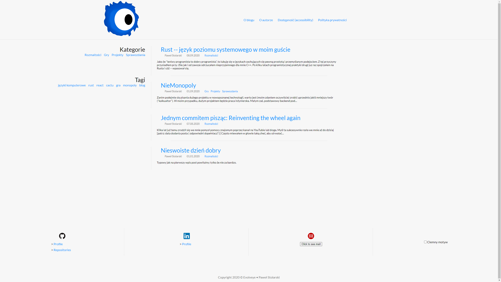

Kilka lat już temu zrodził się we mnie pomysł pomocy znajomym poprzez kanał na YouTubie lub bloga.
Myśl ta sukcesywnie rosła we mnie aż do dzisiaj [patrz: data dodania posta ([odpowiedni dopełniacz?](https://sjp.pwn.pl/poradnia/haslo/post;7717.html))]

Często miewałem w głowie taką cheć, aby utrwalać swoje ~~zawodowe~~ przemyślenia. Być może komuś kiedyś (mi) się one przydadzą.
Jako, że niebawem będę rozpoczynać życie zawodowe (tak, nigdy nie pracowałem zarobkowo) to uznałem,
że stworzenie sobie strony internetowej na której mógłbym zamieszczać proste projekty lub linki do co ciekawszych mych tworów to dobry pomysł.

Miałem już kilka podejść do tworzenia sobie strony, i za każdym razem kończyło się to jakaś formą niepowodzenia --
projekt porzucony, wsparcie elementu WebAPI wygasło, za prosta, za brzydka, mało treściwa.
Teraz jednak liczę na to, że dodając od czasu do czasu swoje myśli na stronie, będzie ona atrakcyjniejsza w odbiorze.

Taka personalna strona z blogiem byłaby dla mnie:
 * miejscem moich zawodowych dociekań -- mógłbym chociażby dzielić się wiedzą pozyskaną poprzez pytania do innych
 * miejscem w które mogę z łatwością odesłać kogoś do napisanego tekstu --
   czy to rozbudowana opinia która nie nadaje się na czat, czy to opis jakiegoś problemu, *cokolwiek*.
 * publiczną wersją tworzonych sprawozdań (tych wyprodukowanych na ścieżce edukacji lub przez własną chęć opisu *czegoś*)
 * kolejnym punktem rozwoju społeczności (a nawet dwóch)
 * publicznym pokazaniem siecie i swoich kompetencji lub ich braku
 * jedną z form portfolio -- wiele jest takich rzeczy, które nadawałyby się na krótki wpis i mały pokaz
   a ostatecznie po stworzeniu nigdzie nie trafiły (i/więc przepadły)
 * kolejnym oczkiem w głowie, którego mógłbym dogladać i rozwijać

[Kilka](https://sjp.pl/kilka) (lub być może lepiej [parę](https://sjp.pl/kilka)) lat już temu dowiedziałem się o konkursie [Daj się poznać](https://devstyle.pl/daj-sie-poznac/)
lecz moje dowiedzenie się nastąpiło już za późno aby wystartować. Jestem jednak pewny że nic by z tego ówcześnie nie wyszło.
Teraz natomiast (w przeciwieństwie do siebie sprzed lat) robię więcej różności którymi mógłym się podzielić ze światem,
więc czemu by nie spróbować tego zrobić.
Stworzyłem więc prostą templatkę (mimo poprzednich linków nie określiłbym się jako purysta) w Gatsbym i napisałem ten inicjujący post.

## Istniejące już starsze posty

Nietrudno jest zauważyć, że nie jest to pierwszy wpis, lecz któryś już z kolei.
Pozwoliłem sobie zastosować się do popularnej (raczej; na pewno moim zdaniem dobrej)
zasady mówiącej o tym aby napisać kilka treści przed przystąpieniem do publikowania.
Tak więc po napisaniu już czytanego przez Ciebie teraz tekstu i kolejnych poprawkach szablonu
(ten post jest mimo wszystko testem dla poprawnego wyświetlania markdowna z JSXem)
przygotowałem kilka innych wpisów (poprzerabiałem kilka sprawozdań z oczywistą dla wielu wiedzą
oraz podzieliłem się ze światem tym jakie przemyślenia mi towarzyszyły podczas uprawiania IT).

Więc obecna przy wpisie data faktycznie wskazuje na początek tej historii.
[Ten wpis](http://localhost/2020-01-01--Nieswoiste_dzień_dobry/) stanowi jedynie odnośnik do tego tutaj.
Raczej głupio by wyglądał taki blog który zaczął się "z bomby" bez "dzień dobry".

## Wygląd

Próbowałem na różne sposoby stworzyć szablon swej strony, lecz wszystkie one cechowały się albo nadmierną ilością miejsca
na dodatkowe elementy (których nie ma) albo wyglądały jak strona organizacji.

Tę stronę początkowo zrobiłem jako odświeżoną wersję [bloga Comandeera](https://blog.comandeer.pl/).
Nie ukrywam, że trochę się nim sugerowałem. Nie jest to jednak jedyna inspiracja --
spogladałem również na [devstyle.pl](https://devstyle.pl/) oraz na świeżo założoną [Postać normalną](https://postacnormalna.pl/).

Jednak ten wygląd mi nie odpowiadał. Czułem spory niedosyt.
Co prawda daleko mi do projektanta UI/UX, lecz jeśli chcę określać się jako webmaster
to powinienem umieć zrobić chociażby poprawną lub znoścną stronę.
Pokusiłem się więc na odrobinę [neumorfizmu](https://antyweb.pl/nowy-skeumorfizm-i-fluent-design-kontra-plaskie-interfejsy/).

Dodatkowo warto zaznaczyć jedną rzecz -- poczatkowo uznałem, że [mobile first](https://chcenawczoraj.pl/software/na-czym-polega-mobile-first-w-projektowaniu)
nie jest mi wielce potrzebny w tym przypadku, ponieważ tak prosty projekt jak blog to przecież pojedyncze boxy,
których rozmieszczenie zależy od "flexowego" wyświetlania, lub grida. To był spory bład myślowy,
ponieważ natrafiłem na problemy związane z pozycjonowaniem relatywnym po przesunięciu elementu.
To tylko jeden z wielu problemów które mogły się przytrafić. Dodatkowo moje wytłumaczenie było bez sensu,
gdyż obecnie większość stron to pojedyncze okna które łatwo dopasować do wygladu mobilnego
(a jest tak pewnie dlatego, gdyż właśnie projektanci stosują sie do `mobile first`).