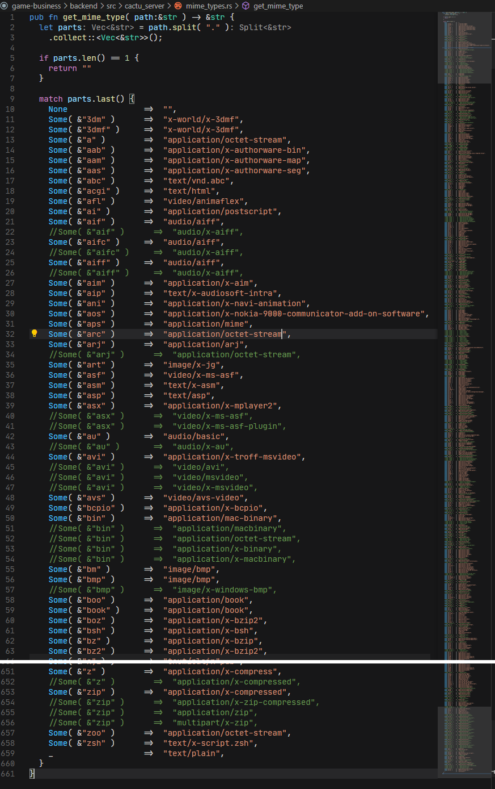
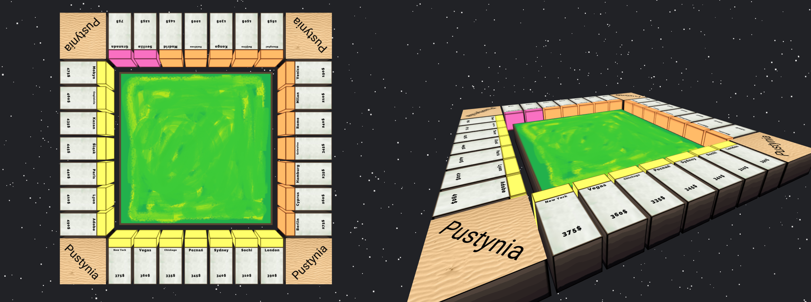
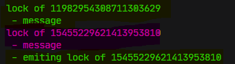

Zanim podejmie się pisania dużego projektu w nowopoznanej technologii,
warto jest (moim zdaniem oczywiście) zrobić uprzednio jakiś mniejszy twór ("kalkualtor").

W moim przypadku, dużym projektem będzie praca inżynierska.
Małym zaś, podstawowy backend pod tworzenie gry -- w tym przypadku monopoly.


## Załozenia projektu


Skoro gra ta ma pełnić dla mnie rolę rozgrzewki i wstępu do programowania w języku Rust,
to powinna w sobie zawierać różne elementy uczące korzystania z tego jezyka.
Nie może być to projekt zbyt prosty (alby wręcz zbyt trywialny biedny kalkulatorze),
ponieważ takowy nie nauczy mnie nic w tematach `ownership`, `borrowing`, `lifetime`, *cokolwiek*.

Postanowiłem więc zrobić sam backend dla gry jaką będzie coś na wzór monopoly.
Frontent zaś przygotuję z pomocą aplikacji Reacta. Skoro zaś pojawiają się pojęcia `frontu` i `backu`,
to można się łatwo domyśleć, że że projekt będzie wymagać ruchu sieciowego -- tenże również napisze w Ruscie.

I to właśnie na ruchu sieciowym postanwoiłem tak na prawdę pozostać.
Celem jest nauczyć się poruszać po nowym języku. Tworzenie gry zostawię sobie na inną okazję.
Doprecyzowujac więc -- chcę zbudować prymitywną wersję serwera http+ws, który obsługiwałby
poprawnie reactowe aplikacje, oraz który dostarczy obsługi ws podobnej do biblioteki socket.io.
Jednak dla prostoty przekazu będę używać słowa `gra`.


## Początek prac


Zacząć należy od przygotowań środowiska pracy. Podejść może być pare.
W jednym podejściu, pliki zarówno frantu jak i backendu mogą być w jednym folderze.
W drugim zaś podejściu, można te środowiska rozdzielić -- i ja uważam, że to podejscie jest lepsze.
Trzecim, mogłaby byc hybryda, pliki współdzielone przez serwer i clienta --
takie rozwiązanie mogłoby się sprawdzić w projektach gdzie "zaplecze" byłoby tworzone w przykładowo Node.js.

Jeśli prace nad grą byłyby prowadzone przez 2 zespoły, nie powinny one sobie wchodzić w drogę.
Strony clienta i serwera będą tworzone z użyciem zupełnie różnych technologii i różnymi
podejsciami do zarządzania plikami. Dodatkowo jestem zdania, że backend powinien być dla frontu
skryty za warstwą abstrakcji i tak na prawdę żadna ze stron nie powinna musieć wiedzieć jak budowana jest ta druga.
W związku z tym root projektu powinien moim zdaniem wyglądać mniej więcej tak:

```
root/
 |- backend/
 |- frontend/
  ` readme.md
```

Po utworzeniu takiej struktury, w folderach `backend` i `frontend` użyłem poleceń kolejno `cargo init` oraz `npx create-react-app`.
Po tej czynności otrzymałem podstawową strukturę dla obu środowisk.


```
root/
 |- backend/
 |   |- src/
 |   |- target/
 |   |- .gitignore
 |   |- Cargo.lock
 |    ` Cargo.toml
 |
 |- frontend/
 |   |- build/
 |   |- node_modules/
 |   |- publix/
 |   |- src/
 |   |- .gitignore
 |   |- package.json
 |    ` package-lock.json
 |
  ` readme.md
```

Z taką bazą można przystąpić do pisania kodu. Od czego jednak zacząć?

Tak jak z każdym projektem -- moje podejście jest takie, aby budować go od ogółu do szczegółu.
Co w pierwszej kolejności powinienem mieć, aby robić cokolwiek więcej?
Jak projekt zostanie przedstawiony użytkownikowi? Na czym cały projekt będzie się opierać?
W obecnym scenariuszu, jest to strona internetowa -- to na niej wszystko będzie się opierać.

Jednak wpisanie `npm start` to w zasadzie nic. Aplikacja Reacta sama stworzy serwer i otworzy stronę w przeglaarce.
Aby podejść do sprawy sensownie, to pliki powinien serwować samodzielnie napisany serwer. Pliki -- właśnie -- jakie.
Jako, ze projekt opiera sie na Reakcie, to hostowane pliki najprościej będzie znaleźć w folderze `frontend/build/`.
Mając to na uwadze, zamiast startować aplikację, lepiej będzie użyć `npm build`.

Kolej nadeszła na rozważania nad serwerem. W tym przypadku, backend ma być jednolity -- nie rozbudowwywalny.
Pisząc to mam na myśli to, że ma stanowić jeden zwarty produkt. Nie ma być częścią czegoś innego. Taki monolit.
Nie ma pełnić rolę modułu dla innego projektu. Dodatkowo warto zauważyć, że serwer będzie pełnić funkcję całej aplikacji.
To serwer wyśle plik strony którą zinterpretuje przegladarka, to serwer przechwyci rządanie aktualizacji protokołu do WebSocket,
oraz to serwer będzie odbierać i odpowiadać na eventy ws.

Czego by nie zrobić po stronie clienta, to serwer będzie tym zarządzać. Pomysł mam więc taki:
w pliku `main.rs`, (czyli głównym pliku backendu) zaciagnać 2 moduły
(bo tak wygląda dołączanie innych plików, po prsotu są to moduły) odpowiedzialne za serwer, oraz za grę.
Oba te moduły zintegruje się w "mainie" tworząc strukturę serwera, przekazując jej handler zdarzeń ws gry, oraz włączając serwer.

~~Zdaję sobie sprawę z tego, ze dużo razy użyłem słowa `serwer`. Na tym jednak nie koniec.~~

Frontend z kolei ma pełnić jedynie funkcje interpretacyjne tego co dostał z serwera.
Nie może być po stronie clienta zawarta żadna logika która moze wpłynąć na serwer.
Client powinien móc jedynie wysyłać sygnały że podjął jakieś działania.

<Aside>
  Oczywiście jest to spore uproszczenie. Client co prawda nie powinien wykonywac logiki, która wpłwyałaby na serwer, lecz powinien wykopnywać logikę wpływajacą na samego siebie. Jest to bardzo pomocne przy pracy z interfejsami sieciowymi. Umożliwia eliminację lagów.
</Aside>

Do rysowania planszy najprościej będzie wykorzystać "nołdowe" (node-owe(?)) moduły `react-three-fiber` oraz `drei`.
Moduły te dostarczają kolejnej niesamowitej warstwy abstrakcji do abstrakcji dostarczanej przez three.js,
które z kolei dostarcza jej dla WebGL dostarczajacego abstrakcji wywołaniom systemowym dosta... dość.
Ważne, że można w tej technologii napisać krótki robiący sporo kod dający w rezultacie całkiem wydajną aplikację.

Warto nadmienić, że pomysł z organizacją serwera i clienta można przedstawić w modelu MVC.
Na serwerze nie jest prostym mówić o `widoku`, lecz załóżmy, że jest to sposób używania modułów w mainie
(tak na prawdę, powinno się na to patrzeć raczej przez pryzmat odpowiedzi serwera do clienta,
lecz w tym opisie całkiem odseparowałem backcend od frontendu).
Kontrolerami będą główna struktura serwera oraz gry. Oba one przyjmują informacje i zarządzają modelami,
którymi są mp. "handler" socketów oraz plansza gry.
Po stronie clienta zaś komponentem widoku będzie jednocześnie kontrolerem.
Plik `App.js` będzie widokiem ponieważ będzie defniować szkielet i styl aplikacji poprzez metodę `render`,
oraz kontrolerem ponieważ będzie zarządzań połączeniami ws jak i będzie konfigurować ustawienia innych modółów.
Za model będzie odpowiadać przykładowo `Tile.js` odpowiedzialny za pojedynczy kafelek gry.
Zdaję sobie oczywiście sprawę z tego, że nie ejst to wzorcowe podejscie.
Uważam jednak, że jest to podejscie wystarczajaco dobre dla małej, skromnej aplikacji -- warto przypomnieć,
że koniec końców to nie będzie gra. Front będzie tu jedynie pełnić podstawowe działania komunikacyjne z serwerem.

<Info>
  Dalszą część wpisu będę kontynuować w czasie przeszłym --
  tekst do tego momentu był wstępem organizacyjnym pisanym przed przystąpieniem do pracy
  a jego dalsze części zostały napisane juz po fakcie.
</Info>


## To samo słodkie, czyli tworzenie -- ale w skrócie


Znalezienie lekkiej i dobrze działającej biblioteki/frameworka dla ruchu http+ws nie jest proste.
Biblioteki głównie obsługują tylko jeden z tych ruchów sieciowych.
Tak dla przykładu [hyper](https://docs.rs/hyper/0.13.7/hyper/) obsługuje ruch http,
lecz taki [ws](https://docs.rs/ws/0.9.1/ws/) jak nazwa wskazuje potrafi zapanować tylko nad websocketami.
To może [Actix](https://actix.rs/)? Potrafi obsługiwać oba ruchy. Jest to prawdą, lecz podobnie jak [Rocket](https://rocket.rs/)
przeznacozny na ten czas jedynie do http, Actix jest "kombajnem". Albo inaczej --
frameworki te dostarczają takiej abstrakcji, że nienauczyłym się z nich Rusta samego w sobie, czyli tego na czym mi zależy.
Znalezione rozwiązanie? Użyć `hyper` wraz z [tokio_tungstenite](https://docs.rs/tokio-tungstenite/0.11.0/tokio_tungstenite/).
Dodatkowo (jak z nazwy tego drugiego wynika) trzeba zaciągnać [tokio](https://docs.rs/tokio/0.2.22/tokio/), lecz to nie problem -- nawet wskazane.
Skoro tokio, to także [futures](https://docs.rs/futures/0.3.5/futures/).
Jako, że do stworzenia aktualizacji protokołu potrzebne są szyfrowanie [sha-1](https://docs.rs/sha-1/0.9.1/sha1/)
oraz kodowanie [bash64](https://docs.rs/base64/0.12.3/base64/) to je takze należało zaciągnać z sieci.

Dysponując tymi paczkami stworzyłem serwer http+ws pisząc aktualizację protokołu jak i przechowywanie socketów samodzielnie.
Ciekawa rzecz, chciałem się tego nauczyć lecz bez jakiegoś dużego ciśnienia i teraz miałem okazję to zrobić.
W celu zrobienia tego poprawnie przydatnym źródłem okazał się [MDN](https://developer.mozilla.org/en-US/docs/Web/API/WebSockets_API/Writing_WebSocket_servers).



Jednakowoż na początku nie zaimplementowałem rozgłaszania broadcast. Jest ono na tyle nietypowym przypadkiem,
że poza samym socketem wymaga dostępu do wszystkich innych. Tak więc sam socket powinien mieć jakiś
bez- lub pośredni dostęp do wektora wszystkich innych socketów.

Zabrałem się więc do frontu. W pierwszej kolejnosci poszło `npm i three.js react-three.fiber drei`.
W zasadzie front nie jest niczym nadzwyczajnym. Ot zależało mi na wyświetlaniu elementów na ekranie.
Najważniejszym jednak był dla mnie kontroler WebSocket -- chiałem aby działał podobnie co [socket.io](https://socket.io/)

```js
componentDidMount() {
  this.ws.on( `founded game`, gameData => {
  this.ws.on( `board update`, boardData => {
  this.ws.on( `move`, moveData => {

  this.ws.emit( `searchGame`, { square:9 } )
  setInterval( () => this.ws.emit( `move`, this.player?.boardId ), 1000 )

  window.game = this
}
```

Co prawda teraz przy wpisywaniu powyższego listingu pomyślałem o tym aby wpisać na początku
`const { ws } = this` albo aby metody `ws` zwracały swój kontekst
aby można było łańcuchowo używać kolejnych metod. Cóż, moze później.



Mając planszę kolej przyszła na graczy -- skaczące prostopadłościany.
Zrobienie jednego gracza to bułka z masłem -- informacja do serwera, że chcę skoczyć,
"rzut kością" i wysolosowanie nowej pozycji, `socket.emit` do clienta, i ustawienie pozycji. Łatwe.

Problem jednak zaczął się przy komunikacji większej ilości graczy.
To jest moment który mnie zdemotywował do dalszego działania.
Ktoś mógłby powiedzieć "No przecieć to to samo co dla jednego, tylko że dla wielu".
W skrócie tak, to prawda. Obsługa wielu graczy różniłaby się od wersji z pojedynczym graczem tym,
że wiadomość o skoku konkretnego gracza należałoby "broadcastować".

Problem w tym, że zrobienie tego nie jest takie oczywiste. Koncepcyjnie to serwer powinien móc
wysyłać wiadomości do socketów. W zwiazku z tym, jako że broadcast nomen omen musi komunikować się ze wszystkimi,
to umieszczenie metody `broadcast` w strukturze (albo rustowo -- w cesze(?)) kontrolera WebSocket jest racjonalne.
Co dalej? Cóż. Programista JSa dałby zwykłą referencję w sockecie do tejze metody. W C++ dałoby radę wskaźnikiem.
Tutaj? Mhmm. Nie chcę używać `unsafe` kodu, więc pominę takie elementy.

W pierwszym podejściu wydzieliłem `receiver` ze struktury socketa i bezpośrednio jego wrzuciłem w loop obsługi zdarzeń.
Zrobiłem to dlatego, ponieważ w czasie broadcastowania iterowanie po wszystkich socketach i ich `lock`owanie
bardzo szybko doprowadzało do [zatrzasku (deadlocka)](https://pl.wikipedia.org/wiki/Zakleszczenie) gdy odbiorca był w strukturze.
Sprawa była oczywista:
 1. Na serwerze znajdują się 2 sockety;
 2. Oba są stale używane przez swój wątek, ponieważ nasłuchują zdarzenia;
 3. Jeden z nich chce nadać wiadomość broadcast, więc musi przechwycić `sender` drugiego;
 4. Operacja kończy się zakleszczeniem, ponieważ drugi nigdy nie odda socketu, a pierwszy nie odpuści oczekiwania.

```rust
let socket_mutex = Arc::new( Mutex::new( Socket::new( ws_stream, broadcast_adapter ) ) );
let mut socket = socket_mutex.lock().await;

loop {
  let msg = socket.wait_for_message().await;

  ...
```

```rust
let (sink, mut stream) = ws_stream.split();
let socket_mutex = Arc::new( Mutex::new( Socket::new( sink, broadcast_adapter ) ) );

loop {
  let msg = stream.next().await.unwrap().unwrap();
  let mut socket = socket_mutex.lock().await;

  ...
```

Wydzielając odbiorcę ze struktury socketu wyeliminowałem ten problem, lecz szybko pojawił się następny.
Nikt/nic (lekko upraszczając) nie ma wpływu na to, kiedy procesor uzna, że czas pracy wątku się skończył
i kolej jest na następny. W związku z tym doszło do sytuacji przedstawionej na screenie poniżej:



Normalnie powinien tam wystąpić jeszcze log `end of lock <id>` lecz nie wystąpił.
W tym przypadku deadlock pojawił się w podobnej sytuacji co przed zmianami --
po zablokowaniu dostępu do obu socketów i próbie wzajemnego dostępu do siebie.

Drugie podejście zakładało stworzenie kanału, którym mógłbym komunikować sockety
i stworzonego specjalnie osobnego `taska` tokio którego jedynym zadaniem byłoby
nasłuchiwanie przychodzących żądań broadcastu.
To sprawiłoby, że żaden socket niemiałby nic wspólnego z jakimkolwiek innym socketem.
W założeniach brzmiało pięknie, lecz zidentyfikowałem jakiś nieznany mi błąd,
który zupełnie psuł poprawne działanie. Przykra sprawa ;/

*Dzień później*  
Lekko zrezygnowany i chcący zabrać się za coś innego spróbowałem dowiedzieć się co może być nie tak.
Co ciekawe, problem leżał w `block_on( self.sink.send( message ) )` -- blokowaniu emitera wiadomości socketu.
Tak jakby przy broadcastowaniu się nagle blokował (bo problem dotyczył tylko broadcastu).
Przy czym operacja dobiega końca -- wiem to, ponieważ skorzystałem z niezawodnego debugowania `println`.
Jak ten problem rozwiązałem? Bardzo słabo:

```rust
pub fn emit( &mut self, message:&str ) {
  let sink_clone = Arc::clone( &self.sink );
  let message = String::from( message );

  thread::spawn( move || if let Err( err ) = block_on( block_on( sink_clone.lock() ).send( message.into() ) ) {
    println!( "Emit error: {}", err );
  } );
}
```

Generalnie, to zdaję sobie sprawę z tego, że to wymaga refaktoryzacji.
Przy czym aby to zrobić, musiałbym najpewniej napisać serwer http od zera, bez udziału `hyper`a.
Wtedy mógłbym też zrobić nieco bardziej solidny serwer http+ws.
Brzmi jak dobry plan, ale motywacji jakby nie za dużo (to jest jawna sugestia dla czytelników aby jakoś na mnie wpłynać).


===


Jako, że jest to mój projekt rozgrzewkowy do srodowiska, to oczywiście nie wiem czy moje rozwiązanie jest słuszne,
lecz projektowo uznałem,


Sama gra raczej nie została przemyślana bardzo dobrze. Ot **po prostu miała działać**.
Dlatego też nie pokusiłem się o najlepsze wzorce, przykładowo [memoizacji](https://en.wikipedia.org/wiki/Memoization)(?)


Nie wykluczam późniejszej dalszej aktualizacji tego kodu, ponieważ myślę, ze może się on komuś przydać.
Skoro mi się nie udało znaleźć dobrego serwera http+ws i stworzyłem go samemu, to moze ktoś także będzie poszukiwac i tym razem znajdzie ^^.
Przy czym zaznaczam, że kod ten wymaga sporo poprawek/usprawnień aby móc z niego swobodnie korzysać. Chociaż może pomogłaby społeczność githuba...